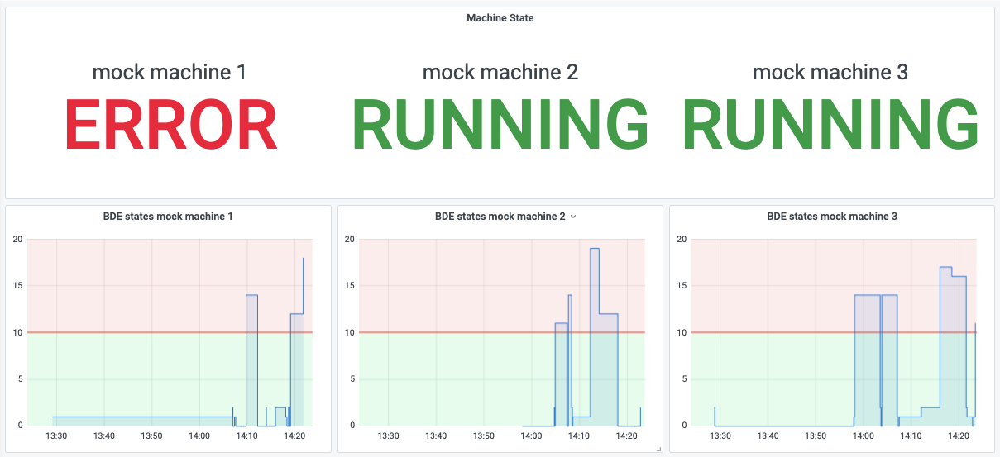

# 🧰 Actyx DemoBox

This example contains applications to get you started with ...

* ... connecting a machine to an Actyx environment,
* ... reading values from the machine,
* ... visualizing values on a dashboard, and
* ... interacting using a web interface.

It also comes with a mock data generator that produces random values for visualization, in case you don't have a PLC at hand.

## Prerequistes

To run this demo, you need the following tools:

* Actyx (https://downloads.actyx.com/)
* NodeJS >= v 14 + NPM (https://nodejs.org/en/)
* Docker (https://www.docker.com/get-started)

To connect to an S7 PLC, it needs to be accessible using TSAP.

## 🚀 Quickstart

To see the demo in action w/o having to connect to a PLC, you need to start the DB exporter, the dashboard and the application generating machine mock readings:

* Clone this repository
* Run `npm install` from the project folder
* Make sure `Actyx` is running on your node
* Start the dasboard and database by running `./dasboard.sh -i` from `src/postgres-grafana`. If you don't use bash, please refer to [the dashboard README](src/postgres-grafana/README.md).
* Run the worker ui application using `npm run ui:worker-ui:start` from the project root.
* Start the DB exporter using `npm run node:db-exporter:start` from the project root.

If you want to connect to a Siemens PLC, review the default connection configuration in [src/tsap-connector/settings.ts](src/tsap-connector/settings.ts#L14) and either adjust or set them using the `APP_SETTINGS` environment variable.

Otherwise you can work with example data: Run `npm run node:mock-machine-connector:start` to produce mock machine data.

## 📦 Applications

The demo box project was created using the [`axp` utility for Actyx projects](https://github.com/actyx-contrib/actyx-project-cli). This gives us a common structure and `npm run` scripts for all contained applications.


### 🔌 Machine Connectors

Machine connectors read values from PLCs and publish them as Actyx events.
#### ⚙️ TSAP

The TSAP connector uses [the nodes7 library](https://www.npmjs.com/package/nodes7) to connect to and read values from an S7/Siemens Logo! PLC.

The relevant inputs can be configured and converted into events using a (also configurable) declarative rule set.

For details, see [the application's README](./src/tsap-connector/README.md).
#### ⚙️ OPC UA

We're sorry, the OPC UA connector is not quite finished yet.

If you do need it _now_, please let us know via https://community.actyx.com/.

##### 🎲 Opcua Mock PLC

The opcua-mock-plc starts a opcua-server and simulates a very trivial machine with a state, a speed value, and a temperature.

OPCUA info:
```
default address: opc.tcp://localhost:4334
security: user - actyx | password - actyx
Component State: /mockPLC/State | ns=1;s=state | Int16
Component Speed: /mockPLC/Speed | ns=1;s=speed | Float
Component Temp:  /mockPLC/Temp  | ns=1;s=temp  | Float
```

Start the opcua-mock-plc with `npm run node:opcua-mock-plc:start`.

Use the environment variable `OPCUA_MOCK_PORT` to define another port to start multiple mock-plcs

E.g.:
```
Linux/Mac: set OPCUA_MOCK_PORT=4335; npm run node:opcua-mock-plc:start
Windows: set OPCUA_MOCK_PORT=4335 && npm run node:opcua-mock-plc:start
```

#### 🎲 Mock

The mock machine connector randomly generates different sample events:

* Machine speed readings
* Machine temperature readings
* Machine state changes
* Error events

The event types correspond to the ones that are emitted from machine connectors.

### 🗃️ DB Connector

The DB connector consumes events from the Actyx swarm and exports them into an external database. From this database, the dashboard vizalisations are fed with data.

The exporter is configured to [connect to a PostgreSQL DB on `localhost:5432`](./src/db-exporter/index.ts#L10).

It inserts events into the database in [5s intervals](./src/db-exporter/index.ts#L69) and [batches of 100 events](./src/db-exporter/index.ts#L55). It applies [backpressure](./src/db-exporter/index.ts#L70) as not to overwhelm the database. This might not seem relevant in the demo case, but is included as an elementary pattern to apply in real world use cases.

Events that have already been processed is tracked and [persisted](./src/db-exporter/db.ts#L119) using [OffsetMap](https://developer.actyx.com/docs/reference/js-ts-sdk/interfaces/offsetmap). This can be used to omit superfluous writes to external systems.

The database schema and statements are implemented in [./src/db-exporter/db.ts](./src/db-exporter/db.ts).

### 👷‍♂️ Worker UI

The Worker UI displays current errors and allows for acknowledging and dismissing them. The error resolutions are tracked and visualized on the dashboard.

To generate errors, you can either ...

* ... configure them in a `machine connector` and produce them on an actual PLC,
* ... use the `mock machine connector` for generating random errors, or
* ... open the development mode in the UI by pressing `Ctrl + Shift + Alt + D`

The interface is built in ReactJS using the [Actyx `industrial-ui` library](https://www.npmjs.com/package/@actyx/industrial-ui) with small modifications.


### 📊 Dashboard

For details, please refer to [the application's README](src/postgres-grafana/README.md)




